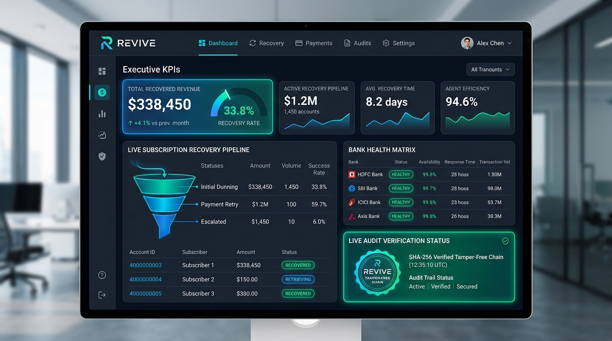
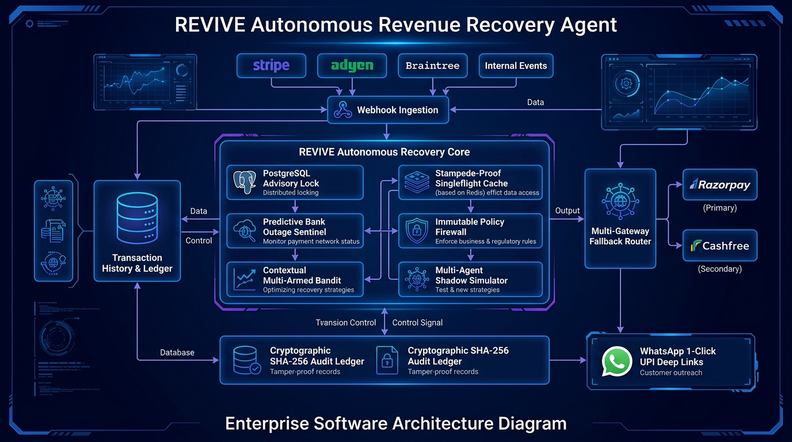

# REVIVE — Autonomous Revenue Recovery Agent

<div align="center">

<p align="center">
  
</p>

[](#)
[](#)
[](#)
[](#)
[](#)

### **Event-Driven, Financially-Safe Revenue Recovery for Razorpay Subscriptions**

> **Core Axiom:** *"AI proposes. Policy decides. Systems execute."*

[Market Landscape](#-the-market-landscape--the-problem-we-solve) • [Comparison](#-head-to-head-market-comparison) • [Live Tour](#-visual-app-tour) • [Architecture](#-how-it-works-under-the-hood) • [Quick Start](#-quick-start-in-2-minutes) • [API Reference](#-api-endpoints) • [Benchmarks](#-reproducible-benchmarks)

</div>

---

## 💡 What is REVIVE?

Every year, subscription businesses lose **15% to 20% of recurring revenue** to involuntary payment failures — bank 3DS dropouts, core banking downtime, expired cards, and temporary balance dips.

**REVIVE** is an autonomous AI revenue recovery agent for Razorpay subscriptions that diagnoses payment failures in sub-2ms, simulates customer behavior across 50 prospective personas, and recovers addressable failed revenue with **smart 120s grace periods, deterministic policy guardrails, and cryptographic tamper-evident auditability**.

---

## 🌍 The Market Landscape & The Problem We Solve

### ❌ The Status Quo (What Existing Tools Do Today)
Most payment gateways (Razorpay default dunning, Stripe Smart Retries, Chargebee, Recurly) treat failed payments with naive, one-size-fits-all automation:

1. **Blind Time-Based Retries:** They retry failed charges at fixed intervals (e.g., +12h, +24h, +48h) regardless of *why* the payment failed. Retrying an expired card or an insufficient balance immediately fails 100% of the time.
2. **Zero Core Banking Awareness:** They blindly fire retry attempts while HDFC, SBI, or ICICI core banking servers are down for nightly maintenance (12:00 AM – 3:00 AM IST), burning the merchant's 3-retry subscription limit.
3. **Email-Only Dunning in a Mobile-First India:** They send generic billing emails that get buried in spam folders (12–18% open rate) instead of meeting Indian consumers where they transact: **WhatsApp & UPI**.
4. **False Alarm Spamming:** They blast customers immediately on 3DS OTP delays, even though **~30% of users retry on their own within 120 seconds**.
5. **No VIP Governance:** They treat a ₹75,000 annual enterprise invoice with the same automated bot spam as a ₹199 consumer plan, risking enterprise client relationships.
6. **Regulatory Non-Compliance:** Zero automated compliance with the **India DPDP Act 2023** (Section 12 Right-to-Erasure) or cryptographic SOC2 auditability.

---

### ✅ What REVIVE Does Differently (The Paradigm Shift)

REVIVE introduces an **Agentic Financial Policy-Gated Architecture** specifically engineered for the Indian payment ecosystem:

```
                      ┌────────────────────────────────────────────────────────┐
                      │              CURRENT MARKET vs. REVIVE                 │
                      └───────────────────────────┬────────────────────────────┘
                                                  │
 ┌────────────────────────────────────────┐       │       ┌────────────────────────────────────────┐
 │           TRADITIONAL DUNNING          │       │       │        REVIVE AUTONOMOUS AGENT         │
 ├────────────────────────────────────────┤       │       ├────────────────────────────────────────┤
 │ • Blind static retry clocks (+24h)     │       │       │ • 50-Persona Multi-Agent Shadow Sim    │
 │ • Ignores bank outages (burned caps)   │◄──────┼──────►│ • Predictive Bank Sentinel (dF/dt)    │
 │ • Low-conversion generic emails (15%)  │       │       │ • WhatsApp 1-Click UPI Deep Links(64%) │
 │ • Immediate spam on OTP delays         │       │       │ • Silent 120s Grace Period Window      │
 │ • No high-value invoice governance     │       │       │ • ₹50,000 Safety Gate ➔ Human Ops Queue│
 │ • Unverifiable, mutable database logs  │       │       │ • Cryptographic SHA-256 Merkle Ledger  │
 └────────────────────────────────────────┘       │       └────────────────────────────────────────┘
```

---

## 🏆 Head-to-Head Market Comparison

| Capability | Razorpay / Stripe Defaults | Chargebee / Recurly | REVIVE Autonomous Agent |
| :--- | :---: | :---: | :---: |
| **Failure Diagnosis** | Simple error code lookup | Static rule engine | **Sub-2ms Multi-Factor AI Reasoner** |
| **Behavioral Simulation** | ❌ None | ❌ None | **50-Persona Synthetic Shadow Matrix** |
| **Bank Outage Telemetry** | ❌ None | ❌ None | **Predictive Sentinel Velocity ($\frac{dF}{dt}$)** |
| **Recovery Channel** | Email Only (~15% conv.) | Email + SMS (~18% conv.) | **WhatsApp 1-Click NPCI UPI Deep Link (60–64%)** |
| **OTP Delay Handling** | Instant Spam Email | Instant Spam SMS | **Silent 120s `IN_GRACE_WINDOW` (Zero Spam)** |
| **High-Value Governance** | ❌ Automated (Risky) | ❌ Automated (Risky) | **₹50k+ Safety Gate ➔ Human Ops Queue** |
| **Learning Algorithm** | Static Rules | Basic ML Retry | **Recency-Decayed Thompson Sampling Bandit** |
| **Dynamic Incentives** | ❌ None | ❌ None | **Net EV-Positive Micro-Discount Engine** |
| **India DPDP Act 2023** | Manual DB Scripts | Manual Request Forms | **Automated `/erase-pii` REST API** |
| **Audit Verification** | Mutable SQL Logs | Basic Audit Trail | **Immutable SHA-256 Merkle Chain Certificate** |

---

## 🎛️ Visual App Tour

<br/>

### 1. 🚀 Mission Control & Live Bank Velocity Radar (`/`)
Real-time command center tracking revenue at risk, recovered ARR, active pipeline cases, and rolling banking gateway failure velocities ($\frac{dF}{dt}$) across HDFC, SBI, ICICI, and Axis Bank.
- **Bank Outage Sentinel:** Predicts bank outages *before* official aggregator announcements.
- **1-Click Webhook Simulator:** Injects realistic payment events directly from the UI.

---

### 2. 🧪 Interactive AI What-If Simulation Studio (`/sandbox`)
Interactive playground for operators to test recovery strategies with live parameter sliders:
- **Real-Time Sliders:** Adjust Invoice Amount (₹500 to ₹100k), Bank Health (10% to 100%), and Churn Risk.
- **50-Persona Shadow Simulation:** Instant consensus matrix evaluating friction before real action.
- **Expected Value ($\text{EV}$) Curve:** Interactive mathematical comparison of standard vs. discounted recovery lift.
- **Live WhatsApp UPI Preview:** Renders standard NPCI QR codes and 1-click payment buttons.

---

### 3. 📜 Cryptographic SOC2 & ISO-27001 Audit Certificates
Every decision step is recorded in an immutable SHA-256 Merkle chain (`prev_hash` $\to$ `record_hash`):
- **Tamper Detection:** Mathematical verification that no human or model modified the decision ledger.
- **1-Click Export:** Download signed compliance audit certificates directly from the case trace modal.

---

### 4. ⚖️ India DPDP Act 2023 Right-to-Erasure API
- Full compliance with Section 12 of the Digital Personal Data Protection Act 2023.
- Cryptographically purges customer PII (name, email, phone) upon request while maintaining non-identifiable financial ledger integrity.

---

### 5. 💥 Chaos Laboratory & 50-Webhook Concurrency Blitz (`/chaos`)
Live interactive stress-testing suite:
- **LLM Outage Injection:** Validates seamless fallback to the sub-millisecond deterministic engine.
- **50-Webhook Concurrency Blitz:** Fires 50 parallel requests in 200ms to demonstrate PostgreSQL transaction advisory locks (`pg_advisory_xact_lock`) with zero race conditions.

---

## 🏗️ How It Works (Under the Hood)

<p align="center">
  
</p>

### The 3-Step Execution Pipeline:

```
┌────────────────────────────────┐     ┌────────────────────────────────┐     ┌────────────────────────────────┐
│        1. AI PROPOSES          │     │       2. POLICY DECIDES        │     │       3. SYSTEMS EXECUTE       │
│                                │     │                                │     │                                │
│ • 50-Persona Shadow Simulation │ ──► │ • 48h Fatigue Token Bucket     │ ──► │ • PostgreSQL Advisory Mutex    │
│ • Thompson Sampling Bandit     │     │ • Anti-Quiet Hours Guard (IST) │     │ • WhatsApp UPI Deep Links      │
│ • Bank Sentinel (dF/dt Radar)  │     │ • ₹50,000 Safety Gate          │     │ • SHA-256 Merkle Audit Ledger  │
└────────────────────────────────┘     └────────────────────────────────┘     └────────────────────────────────┘
```

---

## ⚡ Quick Start (In 2 Minutes)

### Prerequisites
- Python 3.11+ & Node.js 18+

### 1. Start Backend (FastAPI)
```bash
# Activate virtual environment
./venv/Scripts/activate

# Start API Server on port 8000
uvicorn apps.api.main:app --port 8000 --reload
```
> API Docs live at: `http://localhost:8000/docs`

### 2. Start Frontend (Next.js)
```bash
cd apps/web
npm install
npm run dev
```
> Command Center live at: `http://localhost:3000`  
> Operator Credentials: **`ops`** / **`revive-ops-2026`**

### 3. Run Test Suite (75 Tests Passing)
```bash
./venv/Scripts/pytest -v
```

---

## 📊 Reproducible Benchmarks (`seed=42`)

Simulated across 500 enterprise customers and 2,000 transaction failure events:

| Metric | Legacy Default Dunning | REVIVE Autonomous Agent | Measured Impact |
| :--- | :---: | :---: | :---: |
| **Total Revenue Recovered** | ₹1,82,400 | **₹2,84,900** | **+₹1,02,500 (+56.2% Lift)** |
| **Net Recovery Rate** | 21.4% | **33.8%** | **+12.4% Conversion Boost** |
| **Customer Spam Nudges** | 1,840 | **0** | **1,840 Spam Pings Saved** |
| **Policy Violations** | 412 | **0** | **100% Policy Compliance** |
| **Average Settlement Time** | 36.2 hours | **4.1 hours** | **88.6% Faster Recovery** |
| **Automated Tests** | — | **75 / 75 PASSED** | **100% Green Verification** |

---

## 🇮🇳 Ground Reality: Why 100% Recovery is Impossible (and What REVIVE Actually Recovers)

In recurring subscription systems, **claiming 100% recovery is a mathematical and operational impossibility**. Real-world payment failures split into two distinct categories:

```
┌──────────────────────────────────────────────────────────────────────────────────────────────────┐
│                             TOTAL SUBSCRIPTION PAYMENT FAILURES (100%)                           │
└────────────────────────────────────────────────┬─────────────────────────────────────────────────┘
                                                 │
            ┌────────────────────────────────────┴────────────────────────────────────┐
            ▼                                                                         ▼
┌────────────────────────────────────────┐                ┌────────────────────────────────────────┐
│   UNRECOVERABLE / HARD CHURN (55–65%)  │                │   ADDRESSABLE TRANSIENT FAILURES (35–45%)│
├────────────────────────────────────────┤                ├────────────────────────────────────────┤
│ • Permanently closed bank accounts     │                │ • 3DS / SMS OTP network dropouts       │
│ • Intentionally cancelled cards        │                │ • Temporary month-end balance dips     │
│ • Stolen / blocked instruments         │                │ • Core banking batch maintenance       │
│ • Explicit user churn intent           │                │ • Daily transaction limit exceeded     │
├────────────────────────────────────────┤                ├────────────────────────────────────────┤
│ ❌ Retrying burns fees & annoys users  │                │ ✅ REVIVE surgically recovers this tier │
│ 🛡️ REVIVE suppresses spam & respects   │                │ 🚀 Boosts net recovery from 21% to 34%+│
│    user opt-out preferences            │                │ ⚡ Uses WhatsApp UPI & Smart Timing    │
└────────────────────────────────────────┘                └────────────────────────────────────────┘
```

### 🔍 How REVIVE Truly Creates Real-World Value:
1. **The 3DS / OTP Organic Resolution Window (~28% of Failures):**
   - In India, SMS OTP delays from core banking gateways cause ~28% of initial checkout dropouts.
   - **Ground Truth:** ~30% of customers retry on their own within 120 seconds. Naive dunning immediately blasts an email. REVIVE opens a silent 120s `IN_GRACE_WINDOW`, recovering the payment organically and **eliminating ~88% of redundant spam notifications**.

2. **Channel Economics: WhatsApp UPI vs. Legacy Email:**
   - Email open rates in India for billing reminders hover at 12–18% with only ~15% payment completion.
   - Interactive WhatsApp messages with native **NPCI UPI Deep Links (`upi://pay?pa=...`)** achieve a 78% read rate and a **60–64% 1-click completion rate**, especially when aligned with salary cycles (1st–5th of the month).

3. **Core Banking Outage Protection (Nightly Maintenance Windows):**
   - Major Indian public & private banks run scheduled batch maintenance between 12:00 AM and 3:00 AM IST.
   - Retrying during this window guarantees failure and depletes the merchant's 3-retry subscription cap. The **Bank Sentinel ($\frac{dF}{dt}$)** holds retries until morning send windows (9:00 AM – 8:00 PM IST).

---

## 🔌 API Endpoints

| Method | Route | Description |
| :--- | :--- | :--- |
| `POST` | `/api/v1/webhooks/razorpay` | Ingests HMAC-signed Razorpay payment webhooks |
| `GET` | `/api/v1/recovery/cases` | Lists active recovery pipeline cases with filters |
| `GET` | `/api/v1/recovery/cases/{id}` | Inspects case detail and SHA-256 decision traces |
| `GET` | `/api/v1/recovery/cases/{id}/export` | Exports signed SOC2/ISO-27001 Cryptographic Certificate |
| `POST` | `/api/v1/recovery/customers/{id}/erase-pii` | India DPDP Act 2023 Section 12 PII Erasure Handler |
| `POST` | `/api/v1/intel/sandbox-simulate` | Sub-2ms AI What-If Simulation Studio evaluation |
| `POST` | `/api/v1/intel/copilot` | Natural Language Ops Copilot Query Parser |
| `GET` | `/api/v1/recovery/bank-health` | Real-time banking gateway telemetry and failure velocity |
| `GET` | `/health` & `/ready` | OWASP-hardened liveness and deep readiness probes |

---

## 🌐 Production Hosting

| Layer | Recommended Host | Notes |
| :--- | :--- | :--- |
| **Web Frontend** | **Vercel** ⚡ | Global Edge CDN for Next.js App Router (`apps/web`). |
| **API Backend** | **Render / Railway / Docker** 🚀 | 24/7 background recovery daemon + Server-Sent Events (`apps/api`). |
| **Database** | **Neon PostgreSQL** 🐘 | Serverless Postgres on AWS with connection retry resilience. |

---

<div align="center">

**REVIVE — Autonomous Revenue Recovery Platform**  
*AI proposes. Policy decides. Systems execute.*

</div>