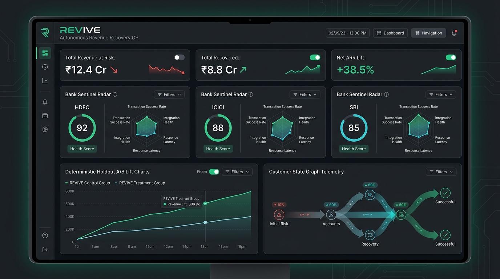
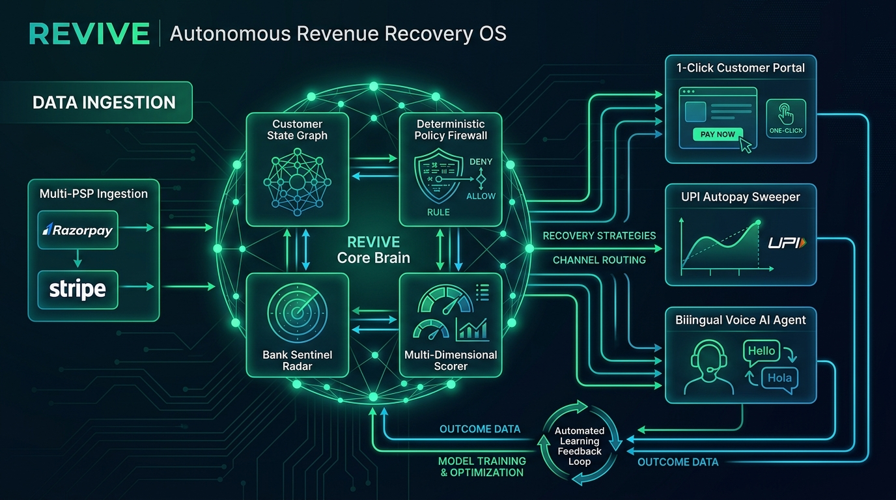
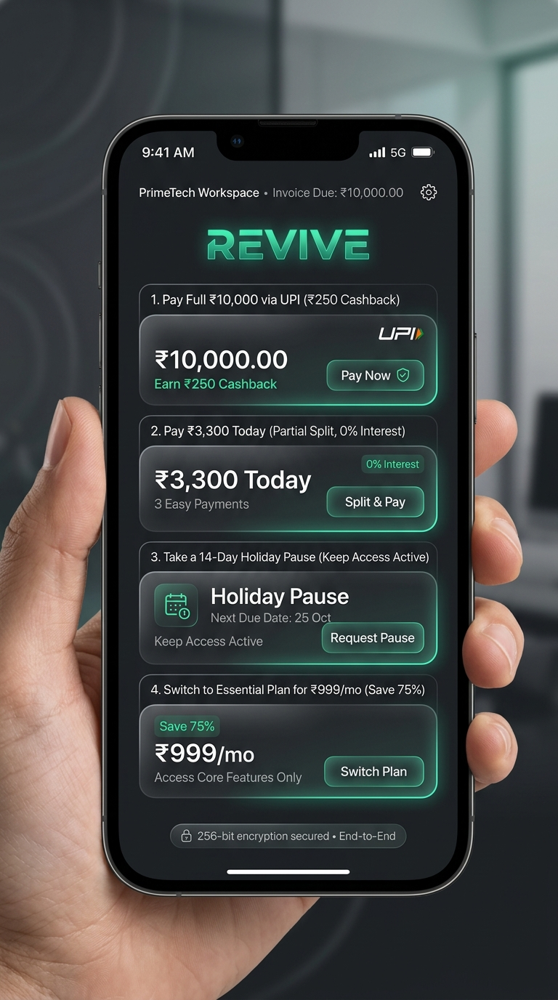

# REVIVE — Autonomous Revenue Recovery OS

<div align="center">

<p align="center">
  
</p>

[](#)
[](#)
[](#)
[](#)
[](#)

### **The Category-Defining Autonomous Revenue Recovery Layer for Modern Subscription Businesses**

> **Core Axiom:** *"AI proposes. Policy decides. Systems execute."*

[The Human Story](#-the-human-side-of-payment-recovery) • [Problems Solved](#-critical-problems-revive-solves) • [Vendor Comparison](#-head-to-head-competitive-matrix) • [Architecture](#-architecture--how-it-works) • [Customer Portal](#-autonomous-customer-self-service-portal) • [Quick Start](#-quick-start-in-2-minutes)

</div>

---

## 💡 What is REVIVE?

Behind every failed recurring payment is a real human being whose day is disrupted:
- A student losing access to their exam prep subscription because their bank SMS OTP was delayed.
- A founder losing 15% to 20% of hard-earned recurring revenue to technical banking brownouts.
- A customer experiencing cash flow timing mismatches between invoice dates and monthly paydays.

Traditional dunning tools treat these humans as cold rows in a database — spamming them with generic emails and firing blind automated retries that trigger ₹250–₹450 bank bounce penalties and burn customer trust.

**REVIVE** is the **Universal Autonomous Revenue Recovery OS** that sits on top of your existing billing stack (Razorpay, Stripe, Chargebee, Recurly). It diagnoses technical failures in sub-2ms, predicts customer liquidity windows, and recovers lost revenue through **partial debt waterfall slicing, salary-cycle timing sweeps, 14-day holiday pauses, bilingual voice AI concierges, and branded self-service recovery portals**.

---

## 🎯 Critical Problems REVIVE Solves

```
┌──────────────────────────────────────┬──────────────────────────────────────────────────────────────────┐
│ Problem in Traditional Billing       │ How REVIVE Solves It Permanently                                │
├──────────────────────────────────────┼──────────────────────────────────────────────────────────────────┤
│ 1. 💀 The "All-or-Nothing" Trap      │ 💧 Partial Waterfall Recovery & Slicing:                         │
│    Demanding ₹10,000 from a customer │ Allows customers to pay ₹3,300 today to keep access active,      │
│    with ₹4,000 results in ₹0         │ automatically syncing the remaining ₹6,700 to their salary date. │
│    recovered & subscription cancelled│                                                                  │
├──────────────────────────────────────┼──────────────────────────────────────────────────────────────────┤
│ 2. 💸 Destructive Bank Bounce Fees   │ 🧠 Salary-Cycle Predictor (06:30 AM IST Sweep):                  │
│    Blindly retrying depleted debit   │ Syncs retries to Indian payroll windows (1st, 5th, 10th). Sweeps │
│    cards triggers ₹250–₹450 NACH     │ early morning before other daily debits, avoiding bounce fees.  │
│    bounce penalties for customers.   │                                                                  │
├──────────────────────────────────────┼──────────────────────────────────────────────────────────────────┤
│ 3. 📉 Reactive Gateway Downtime      │ 🌐 Bank Sentinel Circuit Breaker & Health Matrix:                │
│    Gateways only realize a bank is   │ Tracks real-time telemetry across HDFC, ICICI, SBI, Axis, etc.   │
│    down *after* 100 payments fail.   │ Halts retries during outages and auto-reroutes to RuPay on UPI.  │
├──────────────────────────────────────┼──────────────────────────────────────────────────────────────────┤
│ 4. 🚪 Involuntary Customer Churn     │ 🛡️ Autonomous Churn Rescue (Smart Pause & Micro-Downsell):       │
│    When cash is tight, customers     │ Offers a 14-day holiday pause or micro-tier plan downsell,       │
│    allow accounts to fail and leave. │ preserving 100% of customer relationships and future LTV.        │
├──────────────────────────────────────┼──────────────────────────────────────────────────────────────────┤
│ 5. 🤖 Impersonal, Spammy Dunning     │ 🎙️ Bilingual Voice AI Concierge + WhatsApp UPI Deep Links:       │
│    Ignored generic emails/SMS.       │ Empathetic Hindi/English conversational voice bot that negotiates│
│    High debtor ghosting rates.       │ payment plans and sends 1-click biometric UPI links.             │
├──────────────────────────────────────┼──────────────────────────────────────────────────────────────────┤
│ 6. ⚖️ Audit Blindness & DPDP Risks   │ 🔐 Merkle Audit Ledger & India DPDP Act Compliance:              │
│    Cannot prove fair treatment to    │ Every AI decision has an immutable SHA-256 cryptographic chain,  │
│    RBI/SOC2 auditors or erase PII.   │ with Section 12 compliant 1-click customer data erasure.         │
└──────────────────────────────────────┴──────────────────────────────────────────────────────────────────┘
```

---

## 🏆 Head-to-Head Competitive Matrix

| Capability | **REVIVE** (Our Platform) | **Paddle Retain** | **Butter Payments** | **Stripe Billing** | **Chargebee** | **Churnkey** | **Traditional Dunning** |
| :--- | :---: | :---: | :---: | :---: | :---: | :---: | :---: |
| **Architecture** | **Autonomous Recovery OS** | Closed Billing Suite | ML Retry Layer | Basic Cron Rules | Subscription Suite | Retention Surveys | Outbound Agency |
| **Partial Debt Slicing** | ✅ **Native (33% slice + sync)** | ❌ No | ❌ No | ❌ No | ⚠️ Manual invoice | ❌ No | ⚠️ Manual |
| **Salary-Cycle Sweeping (06:30 AM)** | ✅ **1st, 5th, 10th Windows** | ❌ No | ⚠️ Basic timezone | ❌ No | ❌ No | ❌ No | ❌ No |
| **Bilingual Voice AI Concierge** | ✅ **Hindi / English / Hinglish** | ❌ No | ❌ No | ❌ No | ❌ No | ❌ No | ⚠️ Expensive human callers |
| **Customer Self-Service Portal** | ✅ **Branded `/pay/:id` (4 choices)** | ⚠️ Basic update card | ❌ No UI | ❌ Raw invoice | ⚠️ Hosted portal | ⚠️ Exit flow | ❌ No |
| **14-Day Holiday Pause & Downsell** | ✅ **Automated Churn Rescue** | ✅ Cancellation flow | ❌ No | ⚠️ Basic pause | ⚠️ Manual pause | ✅ Retention offer | ❌ No |
| **India Rails (UPI, Razorpay, e-NACH)**| ✅ **100% Native UPI Deep Links** | ❌ US/Card focused | ❌ Cards only | ⚠️ Basic UPI | ⚠️ Gateway plugin | ❌ No | ❌ US manual |
| **Bank Outage Sentinel Radar** | ✅ **Active circuit breaker matrix**| ❌ No | ⚠️ BIN routing | ❌ No | ❌ No | ❌ No | ❌ No |
| **Scientific A/B Lift Engine** | ✅ **10% Holdout Control vs 90%** | ⚠️ Global model claim | ⚠️ ROI estimates | ❌ No | ❌ No | ❌ No | ❌ No |
| **India DPDP Act 2023 Sec 12** | ✅ **1-Click Cryptographic Scrub** | ⚠️ GDPR only | ❌ No | ⚠️ Standard GDPR | ⚠️ Standard GDPR | ❌ No | ❌ No |
| **Merkle Cryptographic Ledger** | ✅ **SHA-256 Genesis-to-Terminal** | ❌ Mutable DB logs | ❌ Proprietary | ❌ Mutable logs | ❌ Mutable logs | ❌ No | ❌ No |
| **Zero-Leak PII Log Redaction** | ✅ **Real-Time Stream Sanitizer** | ⚠️ Platform logs | ❌ No | ⚠️ Basic | ⚠️ Basic | ❌ No | ❌ No |
| **Dead-Letter Queue (DLQ) Replay** | ✅ **1-Click Self-Healing (`/ops/dlq`)** | ❌ No | ❌ No | ⚠️ Webhook retry | ⚠️ Manual | ❌ No | ❌ No |

---

## 🏗️ Architecture & How It Works

<p align="center">
  
</p>

### The 4-Layer Processing Loop:
1. **Multi-PSP Ingestion:** Standardizes webhook failure events from **Razorpay** (`payment.failed`) and **Stripe** (`invoice.payment_failed`).
2. **Customer State Graph & Scorer:** Updates the persistent journey graph, evaluates $P(\text{pay\_now})$, $P(\text{pay\_salary})$, $P(\text{accept\_partial})$, and computes the Net Expected Value (EV in ₹).
3. **Deterministic Policy Firewall:** Evaluates 12 non-negotiable financial rules, TRAI quiet hours (09:00 AM - 08:00 PM IST), and ₹50k+ VIP safety gates.
4. **Autonomous Execution & Feedback:** Dispatches biometric WhatsApp UPI links, schedules 06:30 AM salary sweeps, or initiates empathetic voice concierge calls.

---

## 🛍️ Autonomous Customer Self-Service Portal (`/pay/{case_id}`)

<div align="center">
<p align="center">
  
</p>
</div>

When debtors receive a recovery link, they land on a **mobile-first, 256-bit encrypted self-service portal** with 4 dignified options:
1. ⚡ **Pay Full Amount (₹10,000):** 1-Click UPI settlement with instant ₹250 cashback reward.
2. 💧 **Pay ₹3,300 Today (Partial Split):** 0% interest debt slice keeping service active; remainder synced to salary day.
3. ⏸️ **Take a 14-Day Holiday Pause:** Freezes subscription billing while preserving all user documents and workspace data.
4. 📉 **Switch to Essential Plan (₹999/mo):** Save 75% on recurring subscription costs with zero penalty.

---

## 🚀 Quick Start in 2 Minutes

### 1. Clone & Setup Environment
```bash
git clone https://github.com/md-shaquib007/AI-Revenue-Recovery.git
cd "AI Revenue Recovery"
python -m venv venv
./venv/Scripts/activate
pip install -r requirements.txt
```

### 2. Run Automated Test Suite (88 Tests)
```bash
pytest -v
```

### 3. Launch Development Server
```bash
uvicorn apps.api.main:app --host 0.0.0.0 --port 8000 --reload
```
- 🌐 **Web UI & Sandbox:** `http://localhost:8000/`
- ⚡ **Interactive Swagger Docs:** `http://localhost:8000/docs`
- 📊 **CFO Command Center API:** `http://localhost:8000/api/v1/intel/command-center`

---

## 🔐 Enterprise Security, Governance & Compliance

- **SOC2 Type-II & Merkle Ledger:** Genesis-to-terminal SHA-256 state tracking for every recovery decision.
- **India DPDP Act 2023 Section 12:** Cryptographic 1-click customer data erasure (`POST /api/v1/recovery/customers/{id}/erase-pii`).
- **Zero-Leak PII Log Redaction:** Real-time regex stream scrubbing for Credit Cards, Phone Numbers, Emails, PAN, and Aadhaar.
- **Multi-Tenant `tenant_id` Partitioning:** Database-level isolation across all tables.
- **Fine-Grained RBAC:** Least-privilege roles (`admin`, `risk_admin`, `operator`, `auditor`, `viewer`).

---

<div align="center">
  <sub>Built with financial intelligence, mathematical rigor, and human empathy by the REVIVE Engineering Team.</sub>
</div>